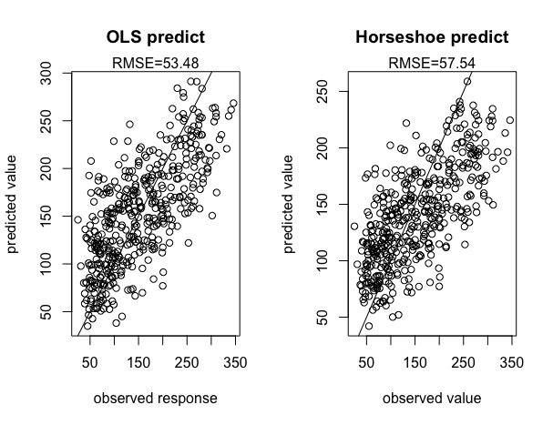

```{r setup, include=FALSE}
fig.dim <- 3
knitr::opts_chunk$set(fig.width=2*fig.dim,
                      fig.height=fig.dim,
                      fig.align='center',
                      message=FALSE)
```


## Robust regressison 

The data used here are from the 'lars' packaage. They consist of 442 rows, each representing a diabetes patient, and 10 columns representing the patients Age, Sex, Body Mass Index, Average Blood Pressure, and six blood serum measurements. The response 'y' represents a continuous measure of disease progression one year after baseline. 

Pairwise interactions of all variables show no significatnt outliers. Importantly, the response variable is not normally distributed. This can be seen by plotting the response vs. the residuals of the Ordinary Least Squares (OLS) regression. The residuals seem to increase with the response variable. Because there are 10 predictor variables and all their interactions (64 total terms), it is likely that OLS is overfitting to try and fit this noisy data. 

We can use robust regression to more effectively fit the coefficents of the predictors, based on those that are more likely to be influential. The idea here is to use a sparsifying prior on the coefficients of the predictors ($\beta$) such that they are highly encouraged to be zero, this draws out only the most important predictors, so that the 'important' coefficients come out of the 64 terms. 

$$ y = \beta_0 + X * \beta + \epsilon $$

The sparsifying prior used here is an alternate parameterization of the 'horseshoe prior' with cauchy noise, which is a scale-mixture of normals resulting in both a computationally efficient, and strongly sparsifying prior. The following realtionship describes this sparse prior on $\beta$ used in our example.

$$ d_{beta}, d_a \sim Normal(0,1) $$

$$ d_b \sim inv_gamma((0.5, 0.5)* \nu) $$
$$ \nu \sim Normal(0,20) $$

$$\tau \sim Uniform(0,1)$$
$$ \beta \sim  d_{beta} *  d_a * \sqrt{d_b} * \tau $$


Notice the hyperprior $\nu$, this allows the inv_gamma to interpolate between cauchy as $\nu$ appraoches zero, and normal as $\nu$ gets infinitely large. This has the effect of not constraining the noise in the data to be cauchy. 

The data were fit using OLS, and using a model with the above parameterization of the horseshoe prior on the coefficients $\beta$. Five fold cross validation was used to compare the cross validation error of each fit. 

The following show root-mean-square (RMS) prediction error for each 'horseshoe' and 'ols' models for each cross validation: 

```
                [,1]      [,2]      [,3]      [,4]      [,5]
ols_pred       0.6082998 0.8078309 0.6883125 0.6305012 0.7113227
horseshoe_pred 0.5936128 0.6519209 0.6345916 0.5992874 0.6417806
ols_fit        0.5572134 0.5394652 0.5440365 0.5492974 0.5367800
horseshoe_fit  0.5997650 0.5801887 0.5945189 0.5963294 0.5803999
```

The horseshoe seems to have a smaller RMS predictions error for each cross-validation compared to the OLS. The mean RMS prediction error across cross validations can be calculated as a row mean for each method: 

```
ols_pred_mean         0.6892534 
horseshoe_pred_mean   0.6242387
```

The horseshoe method shows a `r 0.6892534 - 0.6242387` lower mean RMS prediction error for five-fold cross validatiaon.

A plot of the coefficients of the regression for each method is shown below along with their 95% confidence interval. This plot clearly shows the effect of the strongly sparsifying prior. The sparse regression has more of the coefficients centered near zero, with those that drive the response (more non-zero) more clearly distinguishable as signal. The estimates of the coefficients by OLS are by comparison more noisy and likely to be overfitting due to the number of parameters, and non-normally distributed data. 


Next, the coefficients of the horseshoe fit with a 95% CI not overlapping zero were determined. Those coefficients represented the following predictors: sex, bp, bmi, and ltg. 

Sex, bp, bmi, and ltg were then used to predict the response 'y', and the prediction was plotted vs. the observed value for both methods. The root-mean-square error for each prediction is shown above each plot. The horseshoe prediction shows a slightly higher root-mean-squared error than the ols prediction. The ols prediction is predicting y using all terms in the fit, whereas the horseshoe prediction is only using the four terms mentioned above whose coefficients we are 95% confident are nonzero. 



## Final thoughts

These results display the usefullness of the horseshoe prior for modeling data that are easily subject to overfitting using methods that assume normally distributed data. It is shown that sparsificaiton of the model coefficients using this method increase the signal to noise of the estimate in the coefficients, and that using the horseshoe model to fit the data results in a prediction with similar RMSE of OLS, with only the four most 'important' terms. As an added result, these terms turn out to be very interpretable, sex, bp, bmi, and ltg. By comparison,  non-zero coefficients of the OLS fit include some interaction terms of these variables whose biological interpretation may be less clear, for example the interaction of ldl and ltg.


